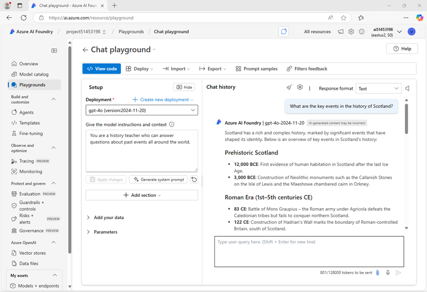

---
lab:
    title: "Preparar un proyecto de desarrollo de IA"
    description: "Aprenda a organizar recursos en la nube en proyectos de Azure AI Foundry para que los desarrolladores estén preparados para el éxito al construir soluciones de IA."
---

# Preparar un proyecto de desarrollo de IA

En este ejercicio, utilizará el portal de Azure AI Foundry para crear un proyecto listo para construir una solución de IA.

Este ejercicio toma aproximadamente **30** minutos.

> **Nota**: Algunas de las tecnologías utilizadas en este ejercicio están en vista previa o en desarrollo activo. Puede experimentar comportamientos inesperados, advertencias o errores.

## Abrir el portal de Azure AI Foundry

Comencemos iniciando sesión en el portal de Azure AI Foundry.

1. En un navegador web, abra el [portal de Azure AI Foundry](https://ai.azure.com) en `https://ai.azure.com` e inicie sesión con sus credenciales de Azure. Cierre cualquier sugerencia o panel de inicio rápido que aparezca la primera vez que inicie sesión y, si es necesario, utilice el logotipo de **Azure AI Foundry** en la parte superior izquierda para navegar a la página de inicio, que se verá similar a la siguiente imagen (cierre el panel **Help** si está abierto):

    

1. Revise la información en la página de inicio.

## Crear un proyecto

Un _proyecto_ de Azure AI proporciona un espacio de trabajo colaborativo para el desarrollo de IA. Comencemos eligiendo un modelo con el que queremos trabajar y creando un proyecto para utilizarlo.

> **Nota**: Los proyectos de AI Foundry pueden basarse en un recurso de _Azure AI Foundry_, que proporciona acceso a modelos de IA (incluido Azure OpenAI), servicios de IA de Azure y otros recursos para desarrollar agentes de IA y soluciones de chat. Alternativamente, los proyectos pueden basarse en recursos de _AI hub_, que incluyen conexiones a recursos de Azure para almacenamiento seguro, computación y herramientas especializadas. Los proyectos basados en Azure AI Foundry son ideales para desarrolladores que desean administrar recursos para el desarrollo de agentes de IA o aplicaciones de chat. Los proyectos basados en AI hub son más adecuados para equipos de desarrollo empresarial que trabajan en soluciones de IA complejas.

1. En la página de inicio, en la sección **Explore models and capabilities**, busque el modelo `gpt-4o`, que utilizaremos en nuestro proyecto.
1. En los resultados de búsqueda, seleccione el modelo **gpt-4o** para ver sus detalles y luego, en la parte superior de la página del modelo, seleccione **Use this model**.
1. Cuando se le solicite crear un proyecto, ingrese un nombre válido para su proyecto y expanda **Advanced options**.
1. Seleccione **Customize** y especifique las siguientes configuraciones para su proyecto:

    - **Azure AI Foundry resource**: _Un nombre válido para su recurso de Azure AI Foundry_
    - **Subscription**: _Su suscripción de Azure_
    - **Resource group**: _Cree o seleccione un grupo de recursos_
    - **Region**: \*Seleccione cualquier **ubicación admitida por AI Services\***\*

    > \* Algunos recursos de Azure AI están limitados por cuotas regionales de modelos. En caso de que se exceda un límite de cuota más adelante en el ejercicio, es posible que necesite crear otro recurso en una región diferente.

1. Seleccione **Create** y espere a que se cree su proyecto. Si se le solicita, implemente el modelo gpt-4o utilizando el tipo de implementación **Global standard** y personalice los detalles de la implementación para establecer un **Tokens per minute rate limit** de 50K (o el máximo disponible si es menor que 50K).

    > **Nota**: Reducir el TPM ayuda a evitar el uso excesivo de la cuota disponible en la suscripción que está utilizando. 50,000 TPM deberían ser suficientes para los datos utilizados en este ejercicio. Si su cuota disponible es menor, podrá completar el ejercicio, pero puede experimentar errores si se excede el límite de tasa.

1. Cuando se cree su proyecto, el playground de chat se abrirá automáticamente para que pueda probar su modelo:

    

1. En el panel de navegación izquierdo, seleccione **Overview** para ver la página principal de su proyecto, que se verá así:

    

1. En la parte inferior del panel de navegación izquierdo, seleccione **Management center**. El centro de gestión es donde puede configurar ajustes tanto a nivel de _recurso_ como de _proyecto_, ambos mostrados en el panel de navegación.

    

    El nivel de _recurso_ se relaciona con el recurso **Azure AI Foundry** que se creó para respaldar su proyecto. Este recurso incluye conexiones a Azure AI Services y modelos de Azure AI Foundry, y proporciona un lugar central para gestionar el acceso de los usuarios a proyectos de desarrollo de IA.

    El nivel de _proyecto_ se relaciona con su proyecto individual, donde puede agregar y gestionar recursos específicos del proyecto.

1. En el panel de navegación, en la sección de su recurso de Azure AI Foundry, seleccione la página **Overview** para ver sus detalles.
1. Seleccione el enlace al **Resource group** asociado con el recurso para abrir una nueva pestaña del navegador y navegar al portal de Azure. Inicie sesión con sus credenciales de Azure si se le solicita.
1. Vea el grupo de recursos en el portal de Azure para ver los recursos de Azure que se han creado para respaldar su recurso de Azure AI Foundry y su proyecto.

    

    Observe que los recursos se han creado en la región que seleccionó al crear el proyecto.

1. Cierre la pestaña del portal de Azure y regrese al portal de Azure AI Foundry.

## Revisar los endpoints (puntos de enlace) del proyecto

El proyecto de Azure AI Foundry incluye varios _endpoints_ que las aplicaciones cliente pueden utilizar para conectarse al proyecto y a los modelos y servicios de IA que incluye.

1. En la página del centro de gestión, en el panel de navegación, bajo su proyecto, seleccione **Go to resource**.
1. En la página **Overview** del proyecto, vea la sección **Endpoints and keys**, que contiene endpoints y claves de autorización que puede utilizar en su código de aplicación para acceder a:
    - El proyecto de Azure AI Foundry y cualquier modelo implementado en él.
    - Azure OpenAI en modelos de Azure AI Foundry.
    - Servicios de IA de Azure.

## Probar un modelo generativo de IA

Ahora que conoce la configuración de su proyecto de Azure AI Foundry, puede regresar al playground de chat para explorar el modelo que implementó.

1. En el panel de navegación izquierdo de su proyecto, seleccione **Playgrounds**.
1. Abra el **Chat playground** y asegúrese de que su implementación del modelo **gpt-4o** esté seleccionada en la sección **Deployment**.
1. En el panel **Setup**, en el cuadro **Give the model instructions and context**, ingrese las siguientes instrucciones:

    ```bash
    You are a history teacher who can answer questions about past events all around the world.
    ```

1. Aplique los cambios para actualizar el mensaje del sistema.
1. En la ventana de chat, ingrese una consulta como `What are the key events in the history of Scotland?` y vea la respuesta:

    

## Resumen

En este ejercicio, ha explorado Azure AI Foundry y ha visto cómo crear y gestionar proyectos y sus recursos relacionados.

## Limpieza

Si ha terminado de explorar el portal de Azure AI Foundry, debe eliminar los recursos que ha creado en este ejercicio para evitar incurrir en costos innecesarios de Azure.

1. En el [portal de Azure](https://portal.azure.com) en `https://portal.azure.com`, vea el contenido del grupo de recursos donde implementó los recursos utilizados en este ejercicio.
1. En la barra de herramientas, seleccione **Delete resource group**.
1. Ingrese el nombre del grupo de recursos y confirme que desea eliminarlo.
