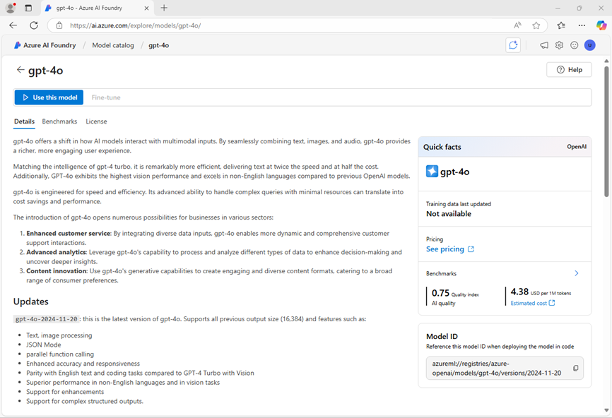

---
lab:
    title: "Elegir e implementar un modelo de lenguaje"
    description: "Las aplicaciones de IA generativa se construyen sobre uno o más modelos de lenguaje. Aprenda cómo encontrar y seleccionar modelos apropiados para su proyecto de IA generativa."
---

# Elegir e implementar un modelo de lenguaje

El catálogo de modelos de Azure AI Foundry sirve como un repositorio central donde puede explorar y utilizar una variedad de modelos, facilitando la creación de su escenario de IA generativa.

En este ejercicio, explorará el catálogo de modelos en el portal de Azure AI Foundry y comparará modelos potenciales para una aplicación de IA generativa que ayuda a resolver problemas.

Este ejercicio tomará aproximadamente **25** minutos.

> **Nota**: Algunas de las tecnologías utilizadas en este ejercicio están en vista previa o en desarrollo activo. Puede experimentar comportamientos inesperados, advertencias o errores.

## Explorar modelos

Comencemos iniciando sesión en el portal de Azure AI Foundry y explorando algunos de los modelos disponibles.

1. En un navegador web, abra el [portal de Azure AI Foundry](https://ai.azure.com) en `https://ai.azure.com` e inicie sesión con sus credenciales de Azure. Cierre cualquier sugerencia o panel de inicio rápido que aparezca la primera vez que inicie sesión y, si es necesario, utilice el logotipo de **Azure AI Foundry** en la parte superior izquierda para navegar a la página de inicio, que se verá similar a la siguiente imagen (cierre el panel **Help** si está abierto):

    

1. Revise la información en la página de inicio.
1. En la página de inicio, en la sección **Explore models and capabilities**, busque el modelo `gpt-4o`, que utilizaremos en nuestro proyecto.
1. En los resultados de búsqueda, seleccione el modelo **gpt-4o** para ver sus detalles.
1. Lea la descripción y revise la otra información disponible en la pestaña **Details**.

    

1. En la página del modelo **gpt-4o**, vea la pestaña **Benchmarks** para ver cómo se compara el modelo en algunos benchmarks estándar de rendimiento con otros modelos utilizados en escenarios similares.

    

1. Use la flecha hacia atrás (**&larr;**) junto al título de la página **gpt-4o** para regresar al catálogo de modelos.
1. Busque `Phi-4-mini-instruct` y vea los detalles y benchmarks para el modelo **Phi-4-mini-instruct**.

## Comparar modelos

Ha revisado dos modelos diferentes, ambos podrían utilizarse para implementar una aplicación de chat de IA generativa. Ahora comparemos las métricas de estos dos modelos visualmente.

1. Use la flecha hacia atrás (**&larr;**) para regresar al catálogo de modelos.
1. Seleccione **Compare models**. Se mostrará un gráfico visual para la comparación de modelos con una selección de modelos comunes.

    

1. En el panel **Models to compare**, observe que puede seleccionar tareas populares, como _question answering_ para seleccionar automáticamente modelos comúnmente utilizados para tareas específicas.
1. Use el ícono **Clear all models** (&#128465;) para eliminar todos los modelos preseleccionados.
1. Use el botón **+ Model to compare** para agregar el modelo **gpt-4o** a la lista. Luego use el mismo botón para agregar el modelo **Phi-4-mini-instruct** a la lista.
1. Revise el gráfico, que compara los modelos basándose en el **Quality Index** (un puntaje estandarizado que indica la calidad del modelo) y el **Cost**. Puede ver los valores específicos para un modelo manteniendo el mouse sobre el punto que lo representa en el gráfico.

    

1. En el menú desplegable **X-axis**, bajo **Quality**, seleccione las siguientes métricas y observe cada gráfico resultante antes de cambiar a la siguiente:

    - Accuracy
    - Quality index

    Según los benchmarks, el modelo gpt-4o parece ofrecer el mejor rendimiento general, pero a un costo mayor.

1. En la lista de modelos para comparar, seleccione el modelo **gpt-4o** para volver a abrir su página de benchmarks.
1. En la página del modelo **gpt-4o**, seleccione la pestaña **Overview** para ver los detalles del modelo.

## Crear un proyecto de Azure AI Foundry

Para utilizar un modelo, necesita crear un _proyecto_ de Azure AI Foundry.

1. En la parte superior de la página de resumen del modelo **gpt-4o**, seleccione **Use this model**.
1. Cuando se le solicite crear un proyecto, ingrese un nombre válido para su proyecto y expanda **Advanced options**.
1. En la sección **Advanced options**, especifique las siguientes configuraciones para su proyecto:

    - **Azure AI Foundry resource**: _Un nombre válido para su recurso de Azure AI Foundry_
    - **Subscription**: _Su suscripción de Azure_
    - **Resource group**: _Cree o seleccione un grupo de recursos_
    - **Region**: \*Seleccione cualquier **ubicación admitida por AI Services\***\*

    > \* Algunos recursos de Azure AI están limitados por cuotas regionales de modelos. En caso de que se exceda un límite de cuota más adelante en el ejercicio, es posible que necesite crear otro recurso en una región diferente.

1. Seleccione **Create** y espere a que se cree su proyecto. Si se le solicita, implemente el modelo gpt-4o utilizando el tipo de implementación **Global standard** y personalice los detalles de la implementación para establecer un **Tokens per minute rate limit** de 50K (o el máximo disponible si es menor que 50K).

    > **Nota**: Reducir el TPM ayuda a evitar el uso excesivo de la cuota disponible en la suscripción que está utilizando. 50,000 TPM deberían ser suficientes para los datos utilizados en este ejercicio. Si su cuota disponible es menor, podrá completar el ejercicio, pero puede experimentar errores si se excede el límite de tasa.

1. Cuando se cree su proyecto, el playground de chat se abrirá automáticamente para que pueda probar su modelo:

    

## Chatear con el modelo _gpt-4o_

Ahora que tiene una implementación de modelo, puede usar el playground para probarlo.

1. En el playground de chat, en el panel **Setup**, asegúrese de que su modelo **gpt-4o** esté seleccionado y en el campo **Give the model instructions and context**, establezca el prompt del sistema en `You are an AI assistant that helps solve problems.`
1. Seleccione **Apply changes** para actualizar el prompt del sistema.

1. En la ventana de chat, ingrese la siguiente consulta:

    ```yml
    Tengo un zorro, una gallina y un saco de grano que necesito llevar al otro lado de un río en un bote. Solo puedo llevar una cosa a la vez. Si dejo a la gallina y el grano sin supervisión, la gallina se comerá el grano. Si dejo al zorro y la gallina sin supervisión, el zorro se comerá la gallina. ¿Cómo puedo llevar las tres cosas al otro lado del río sin que ninguna sea comida?
    ```

1. Vea la respuesta. Luego, ingrese la siguiente consulta de seguimiento:

    ```yml
    Explica tu razonamiento.
    ```

## Implementar otro modelo

Cuando creó su proyecto, el modelo **gpt-4o** que seleccionó se implementó automáticamente. Ahora implementemos el modelo **Phi-4-mini-instruct** que también consideró.

1. En la barra de navegación izquierda, en la sección **My assets**, seleccione **Models + endpoints**.
1. En la pestaña **Model deployments**, en la lista desplegable **+ Deploy model**, seleccione **Deploy base model**. Luego busque `Phi-4-mini-instruct` y confirme su selección.
1. Acepte la licencia del modelo.
1. Implemente un modelo **Phi-4-mini-instruct** con las siguientes configuraciones:

    - **Deployment name**: _Un nombre válido para su implementación de modelo_
    - **Deployment type**: Global Standard
    - **Deployment details**: _Use la configuración predeterminada_

1. Espere a que la implementación se complete.

## Chatear con el modelo _Phi-4_

Ahora chateemos con el nuevo modelo en el playground.

1. En la barra de navegación, seleccione **Playgrounds**. Luego seleccione el **Chat playground**.
1. En el playground de chat, en el panel **Setup**, asegúrese de que su modelo **Phi-4-mini-instruct** esté seleccionado y en el cuadro de chat, proporcione la primera línea como `System message: You are an AI assistant that helps solve problems.` (el mismo prompt del sistema que usó para probar el modelo gpt-4o, pero como no hay configuración de mensaje del sistema, lo proporcionamos en el primer chat para contexto).
1. En una nueva línea en la ventana de chat (debajo de su mensaje del sistema), ingrese la siguiente consulta:

    ```yml
    Tengo un zorro, una gallina y un saco de grano que necesito llevar al otro lado de un río en un bote. Solo puedo llevar una cosa a la vez. Si dejo a la gallina y el grano sin supervisión, la gallina se comerá el grano. Si dejo al zorro y la gallina sin supervisión, el zorro se comerá la gallina. ¿Cómo puedo llevar las tres cosas al otro lado del río sin que ninguna sea comida?
    ```

1. Vea la respuesta. Luego, ingrese la siguiente consulta de seguimiento:

    ```yml
    Explica tu razonamiento.
    ```

## Realizar una comparación adicional

1. Use la lista desplegable en el panel **Setup** para cambiar entre sus modelos, probando ambos modelos con el siguiente acertijo (la respuesta correcta es 40!):

    ```yml
    Tengo 53 calcetines en mi cajón: 21 azules idénticos, 15 negros idénticos y 17 rojos idénticos. Las luces están apagadas y está completamente oscuro. ¿Cuántos calcetines debo sacar para estar 100% seguro de que tengo al menos un par de calcetines negros?
    ```

## Reflexionar sobre los modelos

Ha comparado dos modelos, que pueden variar tanto en su capacidad para generar respuestas apropiadas como en su costo. En cualquier escenario generativo, necesita encontrar un modelo con el equilibrio adecuado entre su idoneidad para la tarea que necesita realizar y el costo de usar el modelo para la cantidad de solicitudes que espera que maneje.

Los detalles y benchmarks proporcionados en el catálogo de modelos, junto con la capacidad de comparar modelos visualmente, proporcionan un punto de partida útil al identificar modelos candidatos para una solución de IA generativa. Luego puede probar modelos candidatos con una variedad de prompts del sistema y del usuario en el playground de chat.

## Limpieza

Si ha terminado de explorar el portal de Azure AI Foundry, debe eliminar los recursos que ha creado en este ejercicio para evitar incurrir en costos innecesarios de Azure.

1. Abra el [portal de Azure](https://portal.azure.com) y vea el contenido del grupo de recursos donde implementó los recursos utilizados en este ejercicio.
1. En la barra de herramientas, seleccione **Delete resource group**.
1. Ingrese el nombre del grupo de recursos y confirme que desea eliminarlo.
