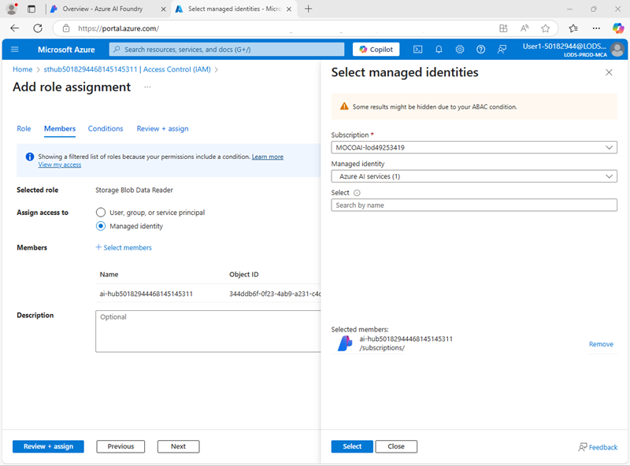

---
lab:
    title: "Usar un prompt flow para gestionar conversaciones en una aplicación de chat"
    description: "Aprenda a utilizar prompt flows para gestionar diálogos conversacionales y asegurar que los prompts se construyan y orquesten para obtener los mejores resultados."
---

## Usar un prompt flow para gestionar conversaciones en una aplicación de chat

En este ejercicio, utilizará el prompt flow del portal de Azure AI Foundry para crear una aplicación de chat personalizada que utilice un prompt de usuario y el historial de chat como entradas, y emplee un modelo GPT de Azure OpenAI para generar una salida.

Este ejercicio tomará aproximadamente **30** minutos.

> **Nota**: Algunas de las tecnologías utilizadas en este ejercicio están en vista previa o en desarrollo activo. Puede experimentar comportamientos inesperados, advertencias o errores.

## Crear un hub y proyecto de Azure AI Foundry

Las características de Azure AI Foundry que usaremos en este ejercicio requieren un proyecto basado en un recurso _hub_ de Azure AI Foundry.

1. En un navegador web, abra el [portal de Azure AI Foundry](https://ai.azure.com) en `https://ai.azure.com` e inicie sesión con sus credenciales de Azure. Cierre cualquier sugerencia o panel de inicio rápido que aparezca la primera vez que inicie sesión y, si es necesario, utilice el logotipo de **Azure AI Foundry** en la parte superior izquierda para navegar a la página de inicio, que se verá similar a la siguiente imagen (cierre el panel **Help** si está abierto):

    

1. En el navegador, navegue a `https://ai.azure.com/managementCenter/allResources` y seleccione **Create new**. Luego elija la opción para crear un nuevo recurso **AI hub**.
1. En el asistente **Create a project**, ingrese un nombre válido para su proyecto y seleccione la opción para crear un nuevo hub. Luego use el enlace **Rename hub** para especificar un nombre válido para su nuevo hub, expanda **Advanced options** y especifique las siguientes configuraciones para su proyecto:

    - **Subscription**: _Su suscripción de Azure_
    - **Resource group**: _Cree o seleccione un grupo de recursos_
    - **Region**: East US 2 o Sweden Central (_En caso de que se exceda un límite de cuota más adelante en el ejercicio, es posible que necesite crear otro recurso en una región diferente._)

    > **Nota**: Si está trabajando en una suscripción de Azure donde se utilizan políticas para restringir los nombres de recursos permitidos, es posible que necesite usar el enlace en la parte inferior del cuadro de diálogo **Create a new project** para crear el hub utilizando el portal de Azure.
    > **Consejo**: Si el botón **Create** sigue deshabilitado, asegúrese de renombrar su hub con un valor alfanumérico único.

1. Espere a que se cree su proyecto.

## Configurar la autorización de recursos

Las herramientas de prompt flow en Azure AI Foundry crean activos basados en archivos que definen el prompt flow en una carpeta en el almacenamiento de blobs. Antes de explorar el prompt flow, asegurémonos de que su recurso de Azure AI Foundry tenga el acceso requerido al blob store para poder leerlos.

1. En una nueva pestaña del navegador, abra el [portal de Azure](https://portal.azure.com) en `https://portal.azure.com`, iniciando sesión con sus credenciales de Azure si se le solicita; y vea el grupo de recursos que contiene los recursos de su hub de Azure AI.
1. Seleccione el recurso **Azure AI Foundry** de su hub para abrirlo. Luego expanda su sección **Resource Management** y seleccione la página **Identity**:

    

1. Si el estado de la identidad asignada por el sistema es **Off**, cámbielo a **On** y guarde los cambios. Luego espere a que se confirme el cambio de estado.
1. Regrese a la página del grupo de recursos y luego seleccione el recurso **Storage account** de su hub y vea su página **Access Control (IAM)**:

    

1. Agregue una asignación de rol al rol `Storage blob data reader` para la identidad administrada utilizada por su recurso de Azure AI Foundry:

    

1. Cuando haya revisado y asignado el acceso de rol para permitir que la identidad administrada de Azure AI Foundry lea blobs en la cuenta de almacenamiento, cierre la pestaña del portal de Azure y regrese al portal de Azure AI Foundry.

## Implementar un modelo de IA generativa

Ahora está listo para implementar un modelo de lenguaje de IA generativa para respaldar su aplicación de prompt flow.

1. En el panel izquierdo de su proyecto, en la sección **My assets**, seleccione la página **Models + endpoints**.
1. En la página **Models + endpoints**, en la pestaña **Model deployments**, en el menú **+ Deploy model**, seleccione **Deploy base model**.
1. Busque el modelo **gpt-4o** en la lista y luego selecciónelo y confírmelo.
1. Implemente el modelo con las siguientes configuraciones seleccionando **Customize** en los detalles de la implementación:

    - **Deployment name**: _Un nombre válido para su implementación de modelo_
    - **Deployment type**: Global Standard
    - **Automatic version update**: Enabled
    - **Model version**: _Seleccione la versión más reciente disponible_
    - **Connected AI resource**: _Seleccione su conexión de recurso de Azure OpenAI_
    - **Tokens per Minute Rate Limit (thousands)**: 50K _(o el máximo disponible en su suscripción si es menor que 50K)_
    - **Content filter**: DefaultV2

    > **Nota**: Reducir el TPM ayuda a evitar el uso excesivo de la cuota disponible en la suscripción que está utilizando. 50,000 TPM deberían ser suficientes para los datos utilizados en este ejercicio. Si su cuota disponible es menor, podrá completar el ejercicio, pero puede experimentar errores si se excede el límite de tasa.

1. Espere a que la implementación se complete.

## Crear un prompt flow

Un prompt flow proporciona una forma de orquestar prompts y otras actividades para definir una interacción con un modelo de IA generativa. En este ejercicio, usará una plantilla para crear un flujo de chat básico para un asistente de IA en una agencia de viajes.

1. En la barra de navegación del portal de Azure AI Foundry, en la sección **Build and customize**, seleccione **Prompt flow**.
1. Cree un nuevo flujo basado en la plantilla **Chat flow**, especificando `Travel-Chat` como nombre de la carpeta.

    Se creará un flujo de chat simple para usted.

    > **Consejo**: Si ocurre un error de permisos, espere unos minutos e intente nuevamente, especificando un nombre de flujo diferente si es necesario.

1. Para poder probar su flujo, necesita computación, y puede tardar un tiempo en iniciarse; así que seleccione **Start compute session** para iniciarlo mientras explora y modifica el flujo predeterminado.

1. Vea el prompt flow, que consiste en una serie de _inputs_, _outputs_ y _tools_. Puede expandir y editar las propiedades de estos objetos en los paneles de edición a la izquierda y ver el flujo general como un gráfico a la derecha:

    

1. Vea el panel **Inputs** y observe que hay dos entradas (historial de chat y la pregunta del usuario).
1. Vea el panel **Outputs** y observe que hay una salida para reflejar la respuesta del modelo.
1. Vea el panel **Chat** LLM tool, que contiene la información necesaria para enviar un prompt al modelo.
1. En el panel **Chat** LLM tool, para **Connection**, seleccione la conexión para el recurso de servicio de Azure OpenAI en su hub de AI. Luego configure las siguientes propiedades de conexión:
    - **Api**: chat
    - **deployment_name**: _El modelo gpt-4o que implementó_
    - **response_format**: {"type":"text"}
1. Modifique el campo **Prompt** de la siguiente manera:

    ```yml
    # system:
    **Objective**: Asistir a los usuarios con consultas relacionadas con viajes, ofreciendo consejos, recomendaciones y asesoramiento como un agente de viajes experto.

    **Capabilities**:
    - Proporcionar información actualizada sobre viajes, incluyendo destinos, alojamientos, transporte y atracciones locales.
    - Ofrecer sugerencias de viaje personalizadas basadas en las preferencias, presupuesto y fechas de viaje del usuario.
    - Compartir consejos sobre equipaje, seguridad y cómo manejar interrupciones en los viajes.
    - Ayudar en la planificación de itinerarios, incluyendo rutas óptimas y puntos de interés imprescindibles.
    - Responder preguntas comunes sobre viajes y proporcionar soluciones a posibles problemas.

    **Instructions**:
    1. Interactúe con el usuario de manera amigable y profesional, como lo haría un agente de viajes.
    2. Utilice los recursos disponibles para proporcionar información de viaje precisa y relevante.
    3. Adapte las respuestas a las necesidades e intereses específicos del usuario.
    4. Asegúrese de que las recomendaciones sean prácticas y consideren la seguridad y comodidad del usuario.
    5. Anime al usuario a hacer preguntas de seguimiento para obtener más asistencia.

    
    # user:
    {{item.inputs.question}}
    # assistant:
    {{item.outputs.answer}}
    

    # user:
    {{question}}
    ```

    Lea el prompt que agregó para familiarizarse con él. Consiste en un mensaje del sistema (que incluye un objetivo, una definición de sus capacidades y algunas instrucciones), y el historial de chat (ordenado para mostrar cada entrada de pregunta del usuario y cada salida de respuesta previa del asistente).

1. En la sección **Inputs** para la herramienta **Chat** LLM (debajo del prompt), asegúrese de que las siguientes variables estén configuradas:

    - **question** (string): ${inputs.question}
    - **chat_history** (string): ${inputs.chat_history}

1. Guarde los cambios en el flujo.

    > **Nota**: En este ejercicio, nos limitaremos a un flujo de chat simple, pero tenga en cuenta que el editor de prompt flow incluye muchas otras herramientas que podría agregar al flujo, permitiéndole crear lógica compleja para orquestar conversaciones.

## Probar el flujo

Ahora que ha desarrollado el flujo, puede usar la ventana de chat para probarlo.

1. Asegúrese de que la sesión de computación esté en ejecución. Si no, espere a que inicie.
1. En la barra de herramientas, seleccione **Chat** para abrir el panel **Chat** y espere a que el chat se inicialice.
1. Ingrese la consulta: `Tengo un día en Londres, ¿qué debería hacer?` y revise la salida. El panel de chat debería verse similar a esto:

    

## Implementar el flujo

Cuando esté satisfecho con el comportamiento del flujo que creó, puede implementar el flujo.

> **Nota**: La implementación puede tardar mucho tiempo y puede verse afectada por limitaciones de capacidad en su suscripción o inquilino.

1. En la barra de herramientas, seleccione **Deploy** e implemente el flujo con las siguientes configuraciones:
    - **Basic settings**:
        - **Endpoint**: New
        - **Endpoint name**: _Ingrese un nombre único_
        - **Deployment name**: _Ingrese un nombre único_
        - **Virtual machine**: Standard_DS3_v2
        - **Instance count**: 1
        - **Inferencing data collection**: Disabled
    - **Advanced settings**:
        - _Use la configuración predeterminada_
1. En el portal de Azure AI Foundry, en el panel de navegación, en la sección **My assets**, seleccione la página **Models + endpoints**.

    Si la página se abre para su modelo gpt-4o, use su botón **back** para ver todos los modelos y endpoints.

1. Inicialmente, la página puede mostrar solo sus implementaciones de modelos. Puede tardar un tiempo antes de que la implementación se liste, e incluso más antes de que se cree exitosamente.
1. Cuando la implementación haya _succeeded_, selecciónela. Luego, vea su página **Test**.

    > **Consejo**: Si la página de prueba describe el endpoint como no saludable, regrese a **models and endpoints** y espere un minuto o más antes de actualizar la vista y seleccionar el endpoint nuevamente.

1. Ingrese el prompt `¿Qué hay para hacer en San Francisco?` y revise la respuesta.
1. Ingrese el prompt `Cuéntame algo sobre la historia de la ciudad.` y revise la respuesta.

    El panel de prueba debería verse similar a esto:

    

1. Vea la página **Consume** para el endpoint y observe que contiene información de conexión y código de ejemplo que puede usar para construir una aplicación cliente para su endpoint, lo que le permite integrar la solución de prompt flow en una aplicación como una aplicación de IA generativa.

## Limpieza

Cuando termine de explorar el prompt flow, debe eliminar los recursos que ha creado para evitar costos innecesarios de Azure.

-   Navegue al [portal de Azure](https://portal.azure.com) en `https://portal.azure.com`.
-   En el portal de Azure, en la página **Home**, seleccione **Resource groups**.
-   Seleccione el grupo de recursos que creó para este ejercicio.
-   En la parte superior de la página **Overview** de su grupo de recursos, seleccione **Delete resource group**.
-   Ingrese el nombre del grupo de recursos para confirmar que desea eliminarlo y seleccione **Delete**.
