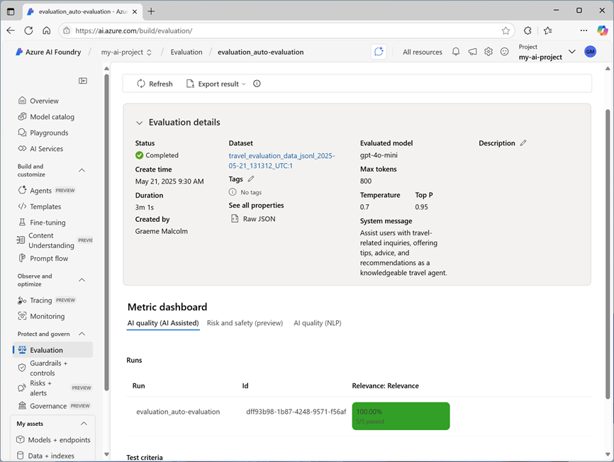

---
lab:
    title: "Evaluar el rendimiento de un modelo de IA generativa"
    description: "Aprende a evaluar modelos y prompts para optimizar el rendimiento de tu aplicación de chat y su capacidad para responder adecuadamente."
---

# Evaluar el rendimiento de un modelo de IA generativa

En este ejercicio, usarás evaluaciones manuales y automatizadas para evaluar el rendimiento de un modelo en el portal de Azure AI Foundry.

Este ejercicio tomará aproximadamente **30** minutos.

> **Nota**: Algunas de las tecnologías utilizadas en este ejercicio están en vista previa o en desarrollo activo. Puedes experimentar comportamientos inesperados, advertencias o errores.

## Crear un hub y proyecto de Azure AI Foundry

Las características de Azure AI Foundry que usaremos en este ejercicio requieren un proyecto basado en un recurso _hub_ de Azure AI Foundry.

1. En un navegador web, abre el [portal de Azure AI Foundry](https://ai.azure.com) en `https://ai.azure.com` e inicia sesión con tus credenciales de Azure. Cierra cualquier sugerencia o panel de inicio rápido que aparezca la primera vez que inicies sesión y, si es necesario, usa el logo de **Azure AI Foundry** en la parte superior izquierda para navegar a la página de inicio, que se verá similar a la siguiente imagen (cierra el panel **Help** si está abierto):

    

1. En el navegador, navega a `https://ai.azure.com/managementCenter/allResources` y selecciona **Create new**. Luego elige la opción para crear un nuevo recurso **AI hub**.
1. En el asistente **Create a project**, ingresa un nombre válido para tu proyecto y selecciona la opción para crear un nuevo hub. Luego usa el enlace **Rename hub** para especificar un nombre válido para tu nuevo hub, expande **Advanced options** y especifica las siguientes configuraciones para tu proyecto:

    - **Subscription**: _Tu suscripción de Azure_
    - **Resource group**: _Crea o selecciona un grupo de recursos_
    - **Region**: Selecciona una de las siguientes ubicaciones (_En caso de que se exceda un límite de cuota más adelante en el ejercicio, es posible que necesites crear otro recurso en una región diferente._):
        - East US 2
        - France Central
        - UK South
        - Sweden Central

    > **Nota**: Si estás trabajando en una suscripción de Azure donde se usan políticas para restringir nombres de recursos permitidos, es posible que necesites usar el enlace en la parte inferior del cuadro de diálogo **Create a new project** para crear el hub usando el portal de Azure.
    > **Consejo**: Si el botón **Create** sigue deshabilitado, asegúrate de renombrar tu hub con un valor alfanumérico único.

1. Espera a que se cree tu proyecto.

## Implementar modelos

En este ejercicio, evaluarás el rendimiento de un modelo gpt-4o-mini. También usarás un modelo gpt-4o para generar métricas de evaluación asistidas por IA.

1. En el panel de navegación izquierdo de tu proyecto, en la sección **My assets**, selecciona la página **Models + endpoints**.
1. En la página **Models + endpoints**, en la pestaña **Model deployments**, en el menú **+ Deploy model**, selecciona **Deploy base model**.
1. Busca el modelo **gpt-4o** en la lista y luego selecciónalo y confírmalo.
1. Implementa el modelo con las siguientes configuraciones seleccionando **Customize** en los detalles de la implementación:

    - **Deployment name**: _Un nombre válido para tu implementación de modelo_
    - **Deployment type**: Global Standard
    - **Automatic version update**: Enabled
    - **Model version**: _Selecciona la versión más reciente disponible_
    - **Connected AI resource**: _Selecciona tu conexión de recurso de Azure OpenAI_
    - **Tokens per Minute Rate Limit (thousands)**: 50K _(o el máximo disponible en tu suscripción si es menor que 50K)_
    - **Content filter**: DefaultV2

    > **Nota**: Reducir el TPM ayuda a evitar el uso excesivo de la cuota disponible en la suscripción que estás usando. 50,000 TPM deberían ser suficientes para los datos utilizados en este ejercicio. Si tu cuota disponible es menor, podrás completar el ejercicio pero puedes experimentar errores si se excede el límite de tasa.

1. Espera a que la implementación se complete.
1. Regresa a la página **Models + endpoints** y repite los pasos anteriores para implementar un modelo **gpt-4o-mini** con las mismas configuraciones.

## Evaluar manualmente un modelo

Puedes revisar manualmente las respuestas del modelo basadas en datos de prueba. La revisión manual te permite probar diferentes entradas para evaluar si el modelo se desempeña como se espera.

1. En una nueva pestaña del navegador, descarga el archivo [travel_evaluation_data.jsonl](https://raw.githubusercontent.com/MicrosoftLearning/mslearn-ai-studio/refs/heads/main/data/travel_evaluation_data.jsonl) desde `https://raw.githubusercontent.com/MicrosoftLearning/mslearn-ai-studio/refs/heads/main/data/travel_evaluation_data.jsonl` y guárdalo en una carpeta local como **travel_evaluation_data.jsonl** (asegúrate de guardarlo como un archivo .jsonl, no como .txt).
1. De vuelta en la pestaña del portal de Azure AI Foundry, en el panel de navegación, en la sección **Protect and govern**, selecciona **Evaluation**.
1. Si el panel **Create a new evaluation** se abre automáticamente, selecciona **Cancel** para cerrarlo.
1. En la página **Evaluation**, ve a la pestaña **Manual evaluations** y selecciona **+ New manual evaluation**.
1. En la sección **Configurations**, en la lista **Model**, selecciona tu implementación del modelo **gpt-4o**.
1. Cambia el **System message** a las siguientes instrucciones para un asistente de viajes de IA:

    ```bash
    Asiste a los usuarios con consultas relacionadas con viajes, ofreciendo consejos, asesoramiento y recomendaciones como un agente de viajes experto.
    ```

1. En la sección **Manual evaluation result**, selecciona **Import test data** y sube el archivo **travel_evaluation_data.jsonl** que descargaste previamente; desplázate hacia abajo para mapear los campos del conjunto de datos de la siguiente manera:
    - **Input**: Question
    - **Expected response**: ExpectedResponse
1. Revisa las preguntas y respuestas esperadas en el archivo de prueba - las usarás para evaluar las respuestas que genera el modelo.
1. Selecciona **Run** desde la barra superior para generar salidas para todas las preguntas que agregaste como entradas. Después de unos minutos, las respuestas del modelo deberían mostrarse en una nueva columna **Output**, así:

    

1. Revisa las salidas para cada pregunta, comparando la salida del modelo con la respuesta esperada y "calificando" los resultados seleccionando el ícono de pulgar arriba o abajo en la parte inferior derecha de cada respuesta.
1. Después de calificar las respuestas, revisa los resúmenes en la parte superior de la lista. Luego en la barra de herramientas, selecciona **Save results** y asígnale un nombre adecuado. Guardar los resultados te permite recuperarlos más tarde para una evaluación adicional o comparación con un modelo diferente.

## Usar evaluación automatizada

Si bien comparar manualmente la salida del modelo con tus propias respuestas esperadas puede ser una forma útil de evaluar el rendimiento de un modelo, es un enfoque que consume mucho tiempo en escenarios donde esperas una amplia variedad de preguntas y respuestas; y proporciona poco en términos de métricas estandarizadas que puedas usar para comparar diferentes combinaciones de modelos y prompts.

La evaluación automatizada es un enfoque que intenta abordar estas limitaciones calculando métricas y usando IA para evaluar respuestas en cuanto a coherencia, relevancia y otros factores.

1. Usa la flecha hacia atrás (**&larr;**) junto al título de la página **Manual evaluation** para regresar a la página **Evaluation**.
1. Ve a la pestaña **Automated evaluations**.
1. Selecciona **Create a new evaluation**, y cuando se te solicite, selecciona la opción para evaluar un **Evaluate a model** y selecciona **Next**.
1. En la página **Select data source**, selecciona **Use your dataset** y selecciona el conjunto de datos **travel*evaluation_data_jsonl*_xxxx..._** basado en el archivo que subiste previamente, y selecciona **Next**.
1. En la página **Test your model**, selecciona el modelo **gpt-4o-mini** y cambia el **System message** a las mismas instrucciones para un asistente de viajes de IA que usaste anteriormente:

    ```bash
    Asiste a los usuarios con consultas relacionadas con viajes, ofreciendo consejos, asesoramiento y recomendaciones como un agente de viajes experto.
    ```

1. Para el campo **query**, selecciona **\{\{item.question\}\}**.
1. Selecciona **Next** para pasar a la siguiente página.
1. En la página **Configure evaluators**, usa el botón **+Add** para agregar los siguientes evaluadores, configurando cada uno de la siguiente manera:

    - **Model scorer**:

        - **Criteria name**: \*Selecciona el preset **Semantic_similarity\***
        - **Grade with**: \*Selecciona tu modelo **gpt-4o\***
        - **User** settings (en la parte inferior):

            Output: \{\{sample.output_text\}\}<br>
            Ground Truth: \{\{item.ExpectedResponse\}\}<br>
            <br>

    - **Likert-scale evaluator**:

        - **Criteria name**: \*Selecciona el preset **Relevance\***
        - **Grade with**: \*Selecciona tu modelo **gpt-4o\***
        - **Query**: \{\{item.question\}\}

    - **Text similarity**:

        - **Criteria name**: \*Selecciona el preset **F1_Score\***
        - **Ground truth**: \{\{item.ExpectedResponse\}\}

    - **Hateful and unfair content**:
        - **Criteria name**: Hate_and_unfairness
        - **Query**: \{\{item.question\}\}

1. Selecciona **Next** y revisa tus configuraciones de evaluación. Deberías haber configurado la evaluación para usar el conjunto de datos de evaluación de viajes para evaluar el modelo **gpt-4o-mini** en cuanto a similitud semántica, relevancia, puntaje F1 y lenguaje odioso e injusto.
1. Dale a la evaluación un nombre adecuado y **Submit** para iniciar el proceso de evaluación, y espera a que se complete. Puede tomar unos minutos. Puedes usar el botón **Refresh** en la barra de herramientas para verificar el estado.

1. Cuando la evaluación haya finalizado, desplázate hacia abajo si es necesario para revisar los resultados.

    

1. En la parte superior de la página, selecciona la pestaña **Data** para ver los datos sin procesar de la evaluación. Los datos incluyen las métricas para cada entrada así como explicaciones del razonamiento que aplicó el modelo gpt-4o al evaluar las respuestas.

## Limpieza

Cuando termines de explorar Azure AI Foundry, debes eliminar los recursos que has creado para evitar costos innecesarios de Azure.

-   Navega al [portal de Azure](https://portal.azure.com) en `https://portal.azure.com`.
-   En el portal de Azure, en la página **Home**, selecciona **Resource groups**.
-   Selecciona el grupo de recursos que creaste para este ejercicio.
-   En la parte superior de la página **Overview** de tu grupo de recursos, selecciona **Delete resource group**.
-   Ingresa el nombre del grupo de recursos para confirmar que deseas eliminarlo y selecciona **Delete**.
